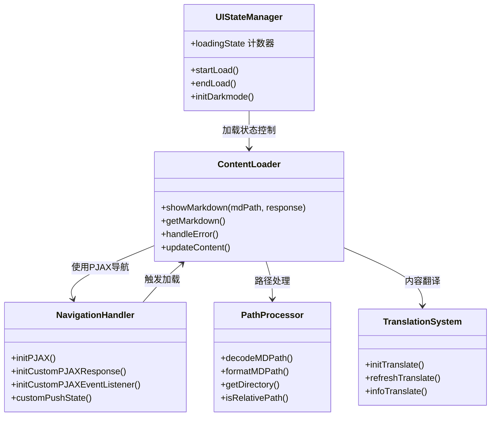
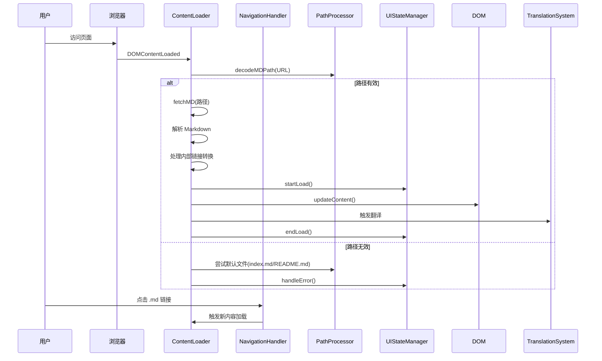

# 核心逻辑实现

## 功能模块说明

## 核心流程

## 关键逻辑说明

### 1. 内容加载流程 (`showMarkdown`)

- **路径解析**：通过 `decodeMDPath()` 解析URL参数
- **文件获取**：优先尝试 `index.md`，失败后回退 `README.md`
- **链接转换**：将文档内 `.md` 相对路径转换为绝对路径
- **DOM更新**：使用 `updateContent()` 注入生成的HTML
- **加载状态**：通过 `loadingState` 计数器管理进度条动画

### 2. PJAX导航系统

- **初始化**：`initPJAX()` 配置选择器和切换规则
- **自定义处理**：覆写`handleResponse` 实现 Markdown 渲染
- **事件委托**：拦截 .md 链接点击事件触发无刷新加载
- **状态管理**：`customPushState()` 维护浏览历史层级

### 3. 翻译系统集成

- **自动检测**：`setAutoDiscriminateLocalLanguage()` 设置语言
- **DOM注入**：`infoTranslate()` 插入语言切换提示条
- **动态刷新**：`refreshTranslate()` 处理动态内容翻译

### 4. 错误处理机制

- **分级捕获**：try/catch 块覆盖关键操作节点
- **友好提示**：`handleError()` 生成带操作按钮的错误界面
- **状态恢复**：错误后自动回退到可用导航状态

### 5. 动画与状态同步

- **CSS动画**：使用 `Animated` 类实现页面过渡效果
- **事件委托**：监听 `animationend` 事件清理DOM残留
- **滚动管理**：内容加载后自动滚动到顶部
