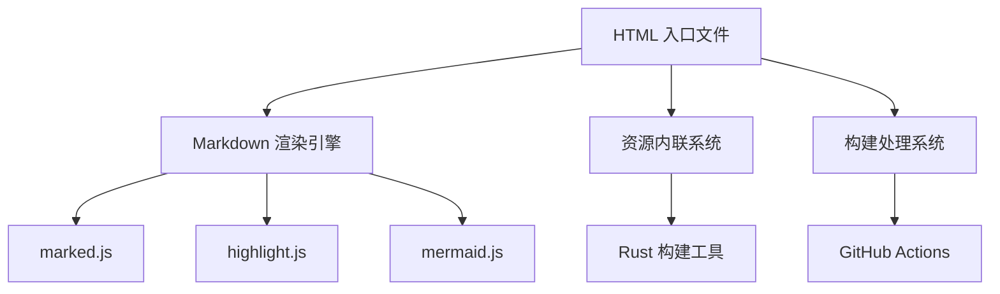

# 核心逻辑实现

## 项目概述

MARKDOWN.HTML 是一个低依赖、一键部署的 Markdown 网页渲染解决方案。项目通过单一 HTML 文件实现完整的 Markdown 渲染功能，支持代码高亮、Mermaid 图表、多语言翻译、深色模式等特性。

## 核心架构

项目采用客户端渲染架构，主要包含以下核心模块：



## 1. HTML 渲染逻辑

### 1.1 版本管理机制

版本号存储在 `index.html` 的自定义标签中：

```html
<markdown-html
  version="1.20.2"
  author="PJ568"
  repo="https://github.com/PJ-568/markdown.html"
  license="CC BY-SA 4.0 International"
></markdown-html>
```

**版本提取逻辑**：

- 通过 `getVersion()` 函数从 DOM 中提取版本信息
- 用于显示关于信息和版本检测

### 1.2 Markdown 渲染流程

#### 主要渲染函数：`showMarkdown()`

**核心流程**：

1. **路径解析**：通过 `decodeMDPath()` 解析 URL 参数 `?p=` 指定的 Markdown 文件路径
2. **文件检测**：自动检测 `index.md` 或 `README.md` 文件
3. **内容获取**：使用 `fetch()` API 获取 Markdown 文件内容
4. **渲染处理**：调用 `getMarkdown()` 进行完整渲染

#### Markdown 处理函数：`getMarkdown()`

**处理步骤**：

1. **原始渲染**：使用 `marked.parse()` 将 Markdown 转换为 HTML
2. **链接处理**：自动转换相对路径为绝对路径
3. **图片处理**：设置懒加载属性，转换相对路径
4. **目录生成**：通过 `generateOutline()` 自动生成文档目录
5. **内容包装**：添加文件路径信息和目录结构

### 1.3 动画与状态管理

**加载动画系统**：

- `loadingState` 对象管理加载状态
- 进度条动画通过 CSS 动画和 JavaScript 定时器实现
- 支持多资源加载的并发计数

**页面切换动画**：

- 使用 CSS 动画实现页面切换效果
- `waitForAnimationsEnd()` 函数等待动画完成

## 2. 多语言支持系统

### 2.1 翻译引擎集成

**初始化流程**：`initTranslate()`

1. 配置 translate.js 使用客户端翻译服务
2. 设置自动语言检测
3. 配置忽略翻译的 CSS 类
4. 执行初始翻译

**翻译提示系统**：`infoTranslate()`

- 检测当前语言与原始语言的差异
- 动态生成翻译提示信息
- 提供切换回原始语言的按钮

### 2.2 语言切换处理

**自动检测**：

- 通过 URL 参数控制语言切换
- 支持浏览器语言偏好设置

**手动切换**：

- 通过 `translate.changeLanguage()` 函数实现语言切换

## 3. PJAX 无刷新导航

### 3.1 PJAX 初始化

**配置**：`initPJAX()`

- 选择器配置：`head title`, `.markdown-body`, `.pjax-reload`
- 动画切换配置：侧滑动画效果
- 缓存策略：禁用缓存破坏

### 3.2 自定义 PJAX 处理

**响应处理重写**：`initCustomPJAXResponse()`

- 覆写 PJAX 的默认响应处理逻辑
- 针对 Markdown 页面进行特殊处理
- 保持标准 HTML 页面的正常处理

**事件监听器**：`initCustomPJAXEventListener()`

- 监听 `.md` 链接的点击事件
- 实现自定义的无刷新页面切换
- 错误处理和回退机制

## 4. 深色模式支持

### 4.1 Darkmode.js 集成

**初始化**：`initDarkmode()`

- 检测 Darkmode.js 库的可用性
- 创建深色模式实例
- 错误处理和兼容性保障

### 4.2 切换控制

**手动切换**：

- 通过 `darkmode.toggle()` 函数切换模式
- 支持跟随系统、浅色、深色三种模式

## 5. 构建与发布系统

### 5.1 Rust 构建工具

项目使用 Rust 编写的构建工具 `src/main.rs` 生成不同版本的 HTML 文件。

#### 核心功能：

1. **HTML 压缩**：`minify_html()`

   - 使用 `minify-html` 库进行压缩
   - 保留关键标签结构
   - 压缩 CSS 和 JavaScript

2. **资源内联**：`all_in_one()`
   - 自动下载外部 CSS 和 JavaScript 资源
   - 使用 `scraper` 库解析 HTML DOM
   - 内联替换外部资源为嵌入式内容

#### 构建流程：

```bash
cargo run --release -- index.html
```

**生成文件**：

- `index.min.html` - 压缩版本
- `index.allinone.html` - 资源内联版本
- `index.allinone.min.html` - 压缩的资源内联版本

### 5.2 版本管理脚本

#### `scripts/get-version.bash`

- 从 HTML 文件中提取版本号
- 支持自定义文件路径
- 多语言错误提示

#### `scripts/is-newer-version.bash`

- 比较当前版本与 Git 标签
- 使用 `sort -V` 进行版本号比较
- 输出新版本号或 "0"（无更新）

#### `scripts/release.bash`

- 交互式版本发布工具
- 版本格式验证（X.X.X）
- 自动创建和推送 Git 标签

### 5.3 GitHub Actions 工作流

**自动化发布流程**：

1. **版本检测**：检查是否需要发布新版本
2. **标签创建**：自动创建 vX.X.X 格式标签
3. **构建处理**：编译 Rust 程序并生成 HTML 文件
4. **发布打包**：准备发布物文件结构
5. **发布创建**：创建 GitHub Release 并部署到 Pages

## 6. 错误处理机制

### 6.1 客户端错误处理

**文件加载错误**：`handleError()`

- 显示友好的错误信息页面
- 提供重新加载和返回功能
- 自动恢复页面状态

**网络请求错误**：

- `fetch()` API 的错误处理
- 超时和网络异常检测
- 友好的用户提示

### 6.2 构建时错误处理

**Rust 错误处理**：

- 自定义 `HtmlProcessorError` 类型
- `Result<T, Box<dyn Error>>` 统一错误处理
- 详细的错误日志输出

## 7. 性能优化特性

### 7.1 懒加载优化

**图片懒加载**：

- 自动设置 `loading="lazy"` 属性
- 减少初始页面加载时间

**资源按需加载**：

- 外部 CSS 动态加载
- 避免阻塞页面渲染

### 7.2 缓存策略

**PJAX 缓存**：

- 禁用缓存破坏机制
- 提高页面切换速度

**浏览器缓存**：

- 合理的缓存头设置
- 减少重复资源下载

## 8. 安全考虑

### 8.1 XSS 防护

**内容安全策略**：

- 安全的 HTML 解析和处理
- 避免脚本注入风险

**外部资源验证**：

- 只加载可信的 CDN 资源
- 资源完整性检查

### 8.2 隐私保护

**翻译服务**：

- 使用客户端翻译避免数据泄露
- 可选的翻译功能

## 技术栈总结

| 组件         | 技术                                | 用途                         |
| ------------ | ----------------------------------- | ---------------------------- |
| **前端渲染** | marked.js, highlight.js, mermaid.js | Markdown 解析和渲染          |
| **用户体验** | translate.js, Darkmode.js, Pjax     | 多语言、深色模式、无刷新导航 |
| **构建工具** | Rust, minify-html, scraper          | HTML 压缩和资源内联          |
| **自动化**   | GitHub Actions, Bash 脚本           | 版本管理和发布流程           |
| **部署**     | GitHub Pages, CDN                   | 静态资源分发                 |

## 核心设计原则

1. **低依赖**：单一 HTML 文件包含所有必要功能
2. **模块化**：各功能组件独立且可替换
3. **可扩展**：易于添加新功能和集成
4. **性能优先**：优化加载速度和用户体验
5. **兼容性**：支持现代浏览器和移动设备
