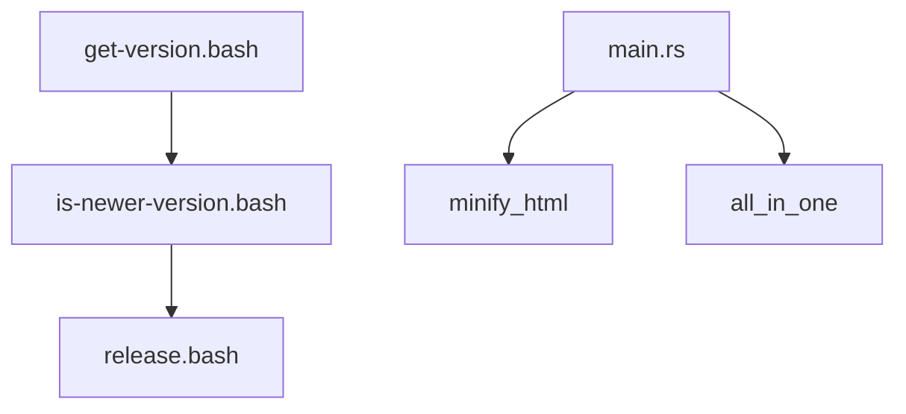
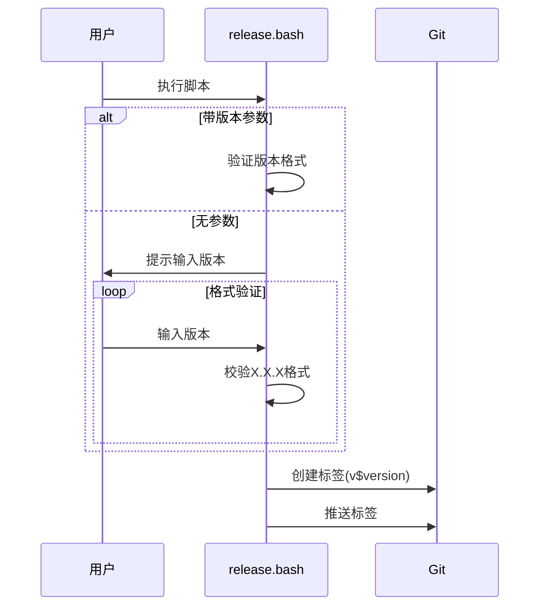
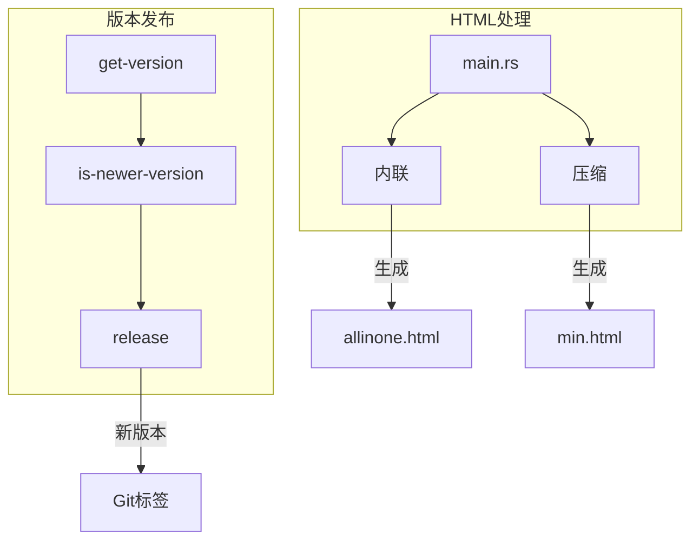

# 脚本与主程序功能设计文档

## 1. 引言

本文档详细说明项目中三个Bash脚本(`get-version.bash`, `is-newer-version.bash`, `release.bash`)和主程序(`src/main.rs`)的设计与功能。这些组件协同工作，实现版本管理、发布流程和HTML处理功能。



## 2. 脚本功能说明

### 2.1 get-version.bash

从HTML文件中提取版本号的核心脚本。

#### 功能设计

1. **路径解析**：
   - 自动检测脚本所在目录(`$SCRIPT_DIR`)
   - 计算仓库根目录(`$REPO_DIR`)
   - 支持自定义文件路径参数(`$1`)

2. **多语言支持**：
   - 通过`LANG`环境变量自动检测中英文
   - `recho()`函数实现双语错误消息

3. **版本提取逻辑**：

```bash
# 从index.html的<markdown-html>标签提取version属性
VERSION=$(grep -oP '<markdown-html\s+version="\K[^"]+' "$FILE_PATH" | head -1)
```

4. **错误处理**：
   - 文件不存在检测(`[ ! -f "$FILE_PATH" ]`)
   - 版本号缺失检测(`[ -z "$VERSION" ]`)

**使用示例**：

```bash
./scripts/get-version.bash # 默认检测index.html
./scripts/get-version.bash path/to/custom.html # 自定义文件
```

### 2.2 is-newer-version.bash

比较当前版本与Git标签，判断是否需要发布新版本。

#### 核心逻辑

1. **版本获取**：
   - 调用`get-version.bash`获取当前版本
   - 获取最新Git标签(`git tag -l 'v*'`)

2. **版本比较算法**：

```bash
[ "$(printf "%s\n%s" "$CURRENT_VERSION" "$LATEST_VERSION" | sort -V | head -n1)" != "$CURRENT_VERSION" ]
```

- 使用`sort -V`进行版本号排序比较
- 当前版本较新时输出版本号，否则输出"0"

3. **边界处理**：
   - 无标签时默认需要发布
   - 自动去除标签的"v"前缀

**输出说明**：

- 输出版本号：需要发布新版本
- 输出"0"：已是最新版本

### 2.3 release.bash

交互式版本发布工具。

#### 工作流程



#### 关键特性

1. **参数解析**：支持`-v/--version`参数
2. **版本验证**：正则校验`^[0-9]+\.[0-9]+\.[0-9]+$`格式
3. **错误处理**：
   - 仓库目录切换失败
   - 标签创建/推送失败
4. **多语言界面**：所有交互提示支持中英文

## 3. 主程序分析(src/main.rs)

HTML处理核心程序，提供压缩和内联功能。

### 3.1 模块结构

```rust
pub fn minify_html(input_path: &str) -> Result<PathBuf> { ... }
pub fn all_in_one(input_path: &str) -> Result<PathBuf> { ... }
fn fetch_external_resource(url: &str) -> Result<String> { ... }
```

### 3.2 minify_html功能

HTML压缩实现：

1. **输出路径生成**：`{filename}.min.html`
2. **压缩配置**：

   ```rust
   let mut cfg = Cfg::new();
   cfg.minify_css = true;
   cfg.minify_js = true;
   cfg.keep_closing_tags = true;
   // 其他配置项...
   ```

3. **压缩执行**：`minify(&code, &cfg)`

### 3.3 all_in_one功能

资源内联实现：

1. **资源获取**：
   - 通过`fetch_external_resource`下载CSS/JS
   - 自定义User-Agent规避拦截
2. **DOM处理**：
   - 使用`scraper`库解析HTML
   - 选择器定位`script[src]`和`link[rel=stylesheet]`
3. **内联替换**：

   ```rust
   // 示例：脚本内联
   let replacement = format!("<script>{}</script>", content);
   processed_html.replace(&original, &replacement);
   ```

### 3.4 错误处理系统

1. **自定义错误类型**：`HtmlProcessorError`
2. **错误传播**：`Result<T, Box<dyn Error>>`统一处理
3. **错误日志**：

   ```rust
   eprintln!("Error minifying HTML: {}", e);
   ```

### 3.5 主流程

```rust
fn main() {
    let input_path = ...; // 获取输入文件
    minify_html(&input_path)?; // 生成压缩版
    let all_in_one_path = all_in_one(&input_path)?; // 生成内联版
    minify_html(all_in_one_path.to_str().unwrap())?; // 压缩内联版
}
```

## 4. 工作流程

组件间的协同关系：



## 5. 使用示例

### 5.1 完整发布流程

```bash
# 检查版本更新
NEW_VER=$(./scripts/is-newer-version.bash)

# 发布新版本
if [ "$NEW_VER" != "0" ]; then
  ./scripts/release.bash -v $NEW_VER
fi
```

### 5.2 HTML处理

```bash
# 处理index.html
cargo run -- index.html

# 生成文件：
# - index.min.html
# - index.allinone.html
# - index.allinone.min.html
```

---
> 本文档最后更新于：2025年6月26日  
