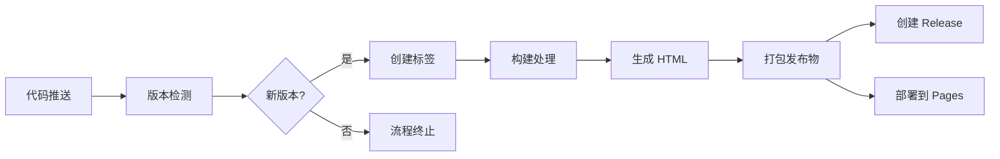
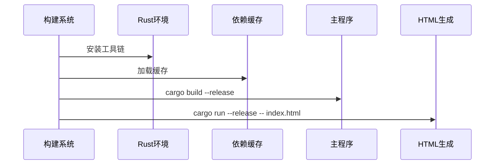

# 自动化发布工作流文档

## 1. 概述

本工作流实现项目的自动化发布流程，包含版本检测、构建处理、发布创建和部署全流程。通过 GitHub Actions 触发，确保发布过程的一致性和可靠性。



## 2. 触发条件

工作流在以下事件触发：

- 推送到`master`分支
- 手动触发(`workflow_dispatch`)

## 3. 核心阶段详解

### 3.1 版本检测阶段

```yaml
- name: Check version
  id: version-check
  run: |
    chmod +x ./scripts/is-newer-version.bash
    chmod +x ./scripts/get-version.bash
    VERSION=$(./scripts/is-newer-version.bash)
    echo "version=${VERSION}" >> $GITHUB_OUTPUT
```

**功能说明**：

1. 赋予脚本执行权限
2. 调用`is-newer-version.bash`检测是否需要发布
3. 输出检测结果：
   - 新版本：输出版本号
   - 无更新：输出"0"

### 3.2 标签创建阶段

```yaml
- name: Push tag
  if: steps.version-check.outputs.version != '0'
  run: |
    tag="v${{ steps.version-check.outputs.version }}"
    git config user.name "${GITHUB_ACTOR}"
    git config user.email "${GITHUB_ACTOR}@users.noreply.github.com"
    git tag -a "${tag}" -m "Release ${tag}"
    git push origin "${tag}"
```

**关键操作**：

- 自动生成 vX.X.X 格式标签
- 配置 Git 用户信息
- 创建并推送带注释的标签

### 3.3 构建处理阶段



**步骤说明**：

1. **环境准备**：
   - 设置 Rust 编译环境
   - 缓存依赖加速构建
2. **项目构建**：
   - 发布模式编译(`cargo build --release`)
3. **HTML 生成**：
   - 执行主程序处理 index.html
   - 产出四种 HTML 变体

### 3.4 发布物打包

```yaml
- name: Copy files
  run: |
    mkdir -p ../release
    cp -v index.html ../release/
    cp -v index.min.html ../release/
    cp -v index.allinone.html ../release/
    cp -v index.allinone.min.html ../release/
    # 附加文件
    cp -v LICENSE ../release/
    cp -v README*.md ../release/
    cp -v CONTRIBUTING.md ../release/
    cp -v CNAME ../release/
    cp -rv doc ../release/
    cp -rv scripts ../release/
    cp -rv src ../release/
```

**发布物结构**：

```plaintext
release/
├── index.html
├── index.min.html
├── index.allinone.html
├── index.allinone.min.html
├── LICENSE
├── README.md
├── README_EN.md
├── CONTRIBUTING.md
├── CNAME
├── doc/
├── scripts/
└── src/
```

### 3.5 发布与部署

```yaml
- name: Create release
  uses: ncipollo/release-action@v1
  with:
    generateReleaseNotes: true
    tag: "v${{ steps.version-check.outputs.version }}"
    artifacts: "../release/index.html,..."

- name: Deploy to GitHub Pages
  uses: actions/deploy-pages@v4
```

**双通道输出**：

1. **GitHub Release**：
   - 自动生成发布说明
   - 包含所有 HTML 变体文件
2. **GitHub Pages**：
   - 自动部署整个 release 目录
   - 即时生效的在线访问

## 4. 错误处理机制

```yaml
- name: Delete tag
  if: (cancelled() || failure()) && steps.push-tag.outputs.tag_name != ''
  run: |
    git push --delete origin "${{ steps.push-tag.outputs.tag_name }}"
    git tag -d "${{ steps.push-tag.outputs.tag_name }}"
```

**回滚策略**：

1. 当流程取消或失败时触发
2. 自动删除已创建的 Git 标签
3. 确保失败发布不会留下无效标签

## 5. 环境配置

| 配置项                   | 说明                     |
| ------------------------ | ------------------------ |
| `runs-on: ubuntu-latest` | 使用最新 Ubuntu 运行环境 |
| `permissions: write-all` | 授予标签推送和发布权限   |
| `working-directory`      | 统一指定操作目录         |

---

> 本文档最后更新于：2025 年 6 月 26 日
